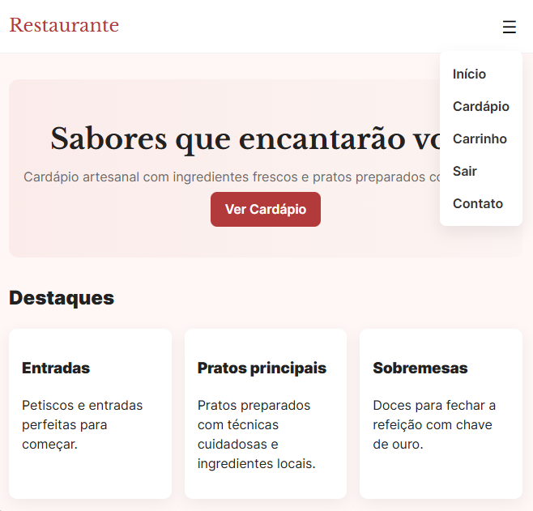
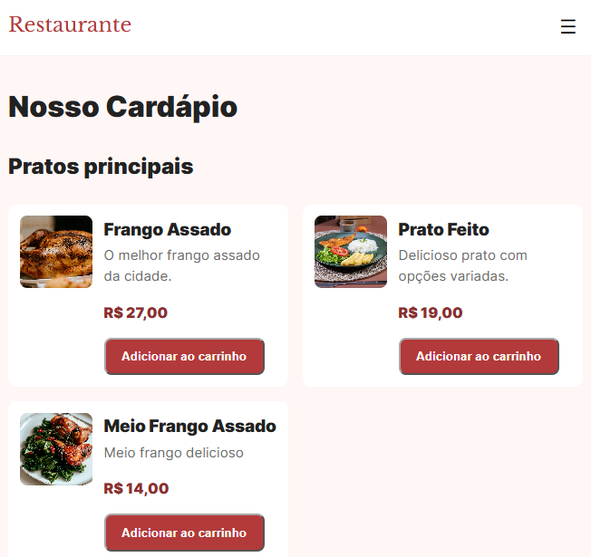
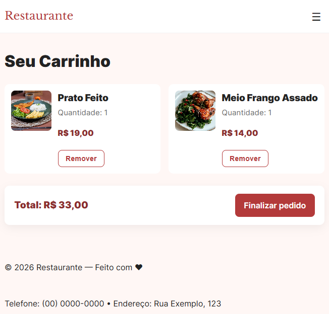
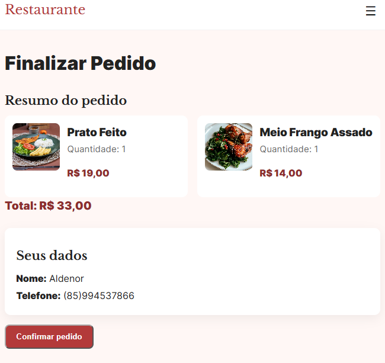
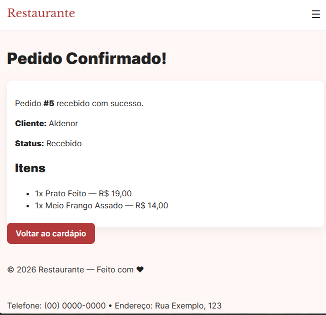

# Sistema de Cardápio Digital


Projeto de e-commerce de alimentos focado em delivery/consumo local, com catálogo de produtos, carrinho de compras, cadastro de clientes, autenticação tradicional e login social com Google. O objetivo principal é demonstrar a criação de uma solução funcional e bem estruturada em Django, com regras de negócio relevantes e experiência de usuário simples e direta.

## Screenshots

### Página inicial


### Cardápio


### Carrinho de compras


### Checkout


### Confirmação do pedido


## Sobre o projeto

Sistema de cardápio digital para restaurantes ou lanchonetes, com funcionalidade de navegação por categoria, visualização de itens disponíveis, adição ao carrinho e finalização de pedido. A solução foi pensada para refletir um fluxo real de e-commerce de alimentação, incluindo validações de negócio e organização por modelos.

### Problema resolvido

O projeto resolve a necessidade de uma interface simples para listar produtos, organizar pedidos e manter o fluxo de compra em um ambiente web, eliminando o uso manual de cardápios e reduzindo a chance de erros de atendimento e processamento do pedido.

### Stack técnica

- Python 3.12+
- Django 6.1
- SQLite
- Pillow
- python-dotenv
- django-allauth
- django-extensions
- HTML/CSS com estilos customizados

## Funcionalidades principais

- Catálogo de produtos por categoria
- Visualização de itens disponíveis com descrição e preço
- Carrinho de compras em sessão
- Adição e remoção de produtos do carrinho
- Cadastro de cliente e autenticação de usuário
- Login tradicional e autenticação social com Google via `django-allauth`
- Fluxo de checkout com validação de dados
- Criação de pedidos e itens vinculados ao cliente
- Controle de status do pedido (Recebido, Em preparo, Pronto, Entregue, Cancelado)
- Validação de regras de negócio no modelo
- Upload de imagens para os produtos
- Mensagens de feedback após ações do usuário

## Tecnologias utilizadas


## Arquitetura e decisões técnicas

A aplicação foi desenvolvida com a arquitetura MVC do Django, separando as responsabilidades entre:

- Models: entidades de domínio como `Produto`, `Categoria`, `Cliente`, `Pedido` e `ItemPedido`
- Views: controle do fluxo de navegação, autenticação, carrinho e checkout
- Templates: renderização das páginas com HTML e CSS
- Services: lógica de criação de pedidos e manipulação do carrinho

### Decisões relevantes

- Validação de regras de negócio diretamente nos modelos, garantindo consistência dos dados no banco
- Uso de `OneToOneField` para associar usuário e cliente, mantendo o relacionamento natural do Django
- Uso do `django-allauth` para integrar autenticação social com Google
- Controle de transição de status do pedido via regras explícitas para impedir mudanças inválidas
- Carrinho gerenciado em sessão, sem necessidade de banco para itens temporários
- Upload de imagens com `ImageField`, permitindo a associação de fotos aos produtos
- Uso de `CheckConstraint` para garantir preços e quantidades positivas
- Uso de transações atômicas na criação de pedidos e no cadastro de clientes

## Como rodar localmente

### Pré-requisitos

- Python 3.12+
- Git
- Virtualenv (opcional, mas recomendado)

### 1. Clone o repositório

```bash
git clone https://github.com/seu-usuario/seu-repositorio.git
cd sistema-cardapio
```

### 2. Crie e ative o ambiente virtual

```bash
python -m venv .venv
# Windows
.venv\Scripts\activate
# Linux/macOS
source .venv/bin/activate
```

### 3. Instale as dependências

```bash
pip install -r requirements.txt
```

### 4. Configure as variáveis de ambiente

Crie um arquivo `.env` na raiz do projeto e defina uma `SECRET_KEY` real, que não seja compartilhada nem versionada:

```env
SECRET_KEY=gere-uma-chave-secreta-diferente-para-cada-ambiente
```

Para habilitar o login com Google, configure também as credenciais do provedor:

```env
GOOGLE_CLIENT_ID=seu-client-id
GOOGLE_CLIENT_SECRET=seu-client-secret
```

O arquivo `.env` é ignorado pelo Git. Se uma chave ou credencial for exposta, revogue-a e gere uma nova imediatamente.

### 5. Execute as migrações

```bash
python manage.py migrate
```

### 6. Crie um superusuário (opcional)

```bash
python manage.py createsuperuser
```

### 7. Inicie o servidor

```bash
python manage.py runserver
```

A aplicação estará disponível em:

```text
http://127.0.0.1:8000/
```

### Autenticação

- Cadastro local: `/cadastro/`
- Login local: `/login/`
- Login com Google: `/accounts/google/login/?process=login`
- Logout: `/logout/` via requisição `POST`

O checkout exige um usuário autenticado e um cliente vinculado à conta. Após o cadastro local, o usuário é autenticado automaticamente e encaminhado para o checkout.

### Testes

Execute a suíte automatizada com:

```bash
python manage.py test
```

Os testes cobrem cadastro e autenticação, carrinho, checkout, criação de pedidos, consolidação de produtos repetidos, disponibilidade de produtos, validações de preço e quantidade, além das transições de status do pedido.

## Desafios enfrentados e soluções aplicadas

### 1. Validação de transição de status do pedido

O principal desafio foi impedir que um pedido fosse movido para estados inválidos, como voltar de “Pronto” para “Em preparo” ou alterar um pedido cancelado.

Solução aplicada:

- regras definidas em `Pedido.Status`
- validação com `TRANSACOES_VALIDAS`
- chamada a `full_clean()` no método `save()` para garantir consistência antes da persistência

### 2. Garantia de integridade do carrinho e do pedido

Era necessário que o pedido (e seus itens) tivesse uma estrutura consistente e sem inconsistências, como quantidade negativa ou pedido vazio.

Solução aplicada:

- uso de `MinValueValidator` e `CheckConstraint`
- bloqueio para remoção do último item de um pedido
- validação no fluxo de checkout para impedir compras vazias ou com produtos indisponíveis

### 3. Experiência de usuário em fluxo de compra

Foi preciso manter a experiência simples, sem burocracia para cadastro e checkout, mesmo com regras de negócio rigorosas.

Solução aplicada:

- cadastro de usuário e cliente em fluxo direto
- mensagens de feedback com `django.contrib.messages`
- validações visíveis e retorno claro para o usuário

### 4. Autenticação e proteção do fluxo de compra

O checkout é protegido por autenticação, o cliente é associado ao usuário por uma relação `OneToOneField` e o pedido confirmado só pode ser consultado pelo usuário dono do pedido. O logout usa `POST` com proteção CSRF.

## Melhorias futuras / roadmap

- Implementar painel administrativo mais robusto para gestão de pedidos e produtos
- Adicionar sistema de pagamento integrado
- Incluir filtros por categoria, busca por nome e ordenação por preço
- Criar API REST com Django REST Framework para consumir em frontend moderno
- Ampliar a cobertura de testes automatizados de unidade e integração
- Preparar a aplicação para deploy em ambiente produtivo com PostgreSQL e variáveis de ambiente seguras
- Implementar autenticação com roles e permissões por perfil

## Repositório e produção

- Repositório: [https://github.com/FilipeMadeira13/sistema-cardapio]
- Produção: “Em desenvolvimento”

## Sobre o autor

Meu nome é Filipe. Sou desenvolvedor Back-end Python, com interesse em construir aplicações que unem clareza de código, boa experiência do usuário e decisões técnicas sólidas.

### Contato

- LinkedIn: [https://www.linkedin.com/in/carlos-filipe-madeira-de-souza-16211922a/]
- GitHub: [https://github.com/FilipeMadeira13]
- E-mail: [cfilipemadeira@gmail.com]

## Conclusão

Este projeto reflete uma abordagem prática de desenvolvimento backend e frontend com Django, combinando lógica de negócio, estrutura de dados bem modelada e foco em usabilidade. Ele é uma demonstração de como resolver problemas reais de forma organizada, com atenção à qualidade de implementação e ao contexto do usuário.


Projeto de e-commerce de alimentos focado em delivery/consumo local, com catálogo de produtos, carrinho de compras, cadastro de clientes e fluxo de pedido. O objetivo principal é demonstrar a criação de uma solução funcional e bem estruturada em Django, com regras de negócio relevantes e experiência de usuário simples e direta.

## Screenshots

### Página inicial


### Cardápio


### Carrinho de compras


### Checkout


### Confirmação do pedido


## Sobre o projeto

Sistema de cardápio digital para restaurantes ou lanchonetes, com funcionalidade de navegação por categoria, visualização de itens disponíveis, adição ao carrinho e finalização de pedido. A solução foi pensada para refletir um fluxo real de e-commerce de alimentação, incluindo validações de negócio e organização por modelos.

### Problema resolvido

O projeto resolve a necessidade de uma interface simples para listar produtos, organizar pedidos e manter o fluxo de compra em um ambiente web, eliminando o uso manual de cardápios e reduzindo a chance de erros de atendimento e processamento do pedido.

### Stack técnica

- Python
- Django
- SQLite
 - Autenticação tradicional e login social com Google via `django-allauth`
- Catálogo de produtos por categoria
- Visualização de itens disponíveis com descrição e preço
- Carrinho de compras em sessão
 - Mensagens de feedback após ações do usuário


## Arquitetura e decisões técnicas

A aplicação foi desenvolvida com a arquitetura MVC do Django, separando as responsabilidades entre:

- Models: entidades de domínio como `Produto`, `Categoria`, `Cliente`, `Pedido` e `ItemPedido`
- Views: controle do fluxo de navegação, autenticação, carrinho e checkout
- Templates: renderização das páginas com HTML e CSS
- Services: lógica de criação de pedidos e manipulação do carrinho

### Decisões relevantes

- Validação de regras de negócio diretamente nos modelos, garantindo consistência dos dados no banco
- Uso de `OneToOneField` para associar usuário e cliente, mantendo o relacionamento natural do Django
- Controle de transição de status do pedido via regras explícitas para impedir mudanças inválidas
 O projeto também pode receber as credenciais do provedor Google pelo ambiente:

 ```env
 GOOGLE_CLIENT_ID=seu-client-id
 GOOGLE_CLIENT_SECRET=seu-client-secret
 ```
- Carrinho gerenciado em sessão, sem necessidade de banco para itens temporários
- Upload de imagens com `ImageField`, permitindo a associação de fotos aos produtos
- Use de `CheckConstraint` para garantir preços e quantidades positivas

## Como rodar localmente

### Pré-requisitos

- Python 3.12+
- Git
- Virtualenv (opcional, mas recomendado)

### 1. Clone o repositório

```bash
git clone https://github.com/seu-usuario/seu-repositorio.git
cd sistema-cardapio
```

### 2. Crie e ative o ambiente virtual

```bash
# Linux/macOS
source .venv/bin/activate
```

### 3. Instale as dependências

```bash
### 4. Configure as variáveis de ambiente

Copie `.env.example` para `.env` e substitua `SECRET_KEY` por uma chave aleatória
que não seja compartilhada nem versionada:

```env
SECRET_KEY=gere-uma-chave-secreta-diferente-para-cada-ambiente

O arquivo `.env` é ignorado pelo Git. Se uma chave for exposta, revogue-a e gere
uma nova imediatamente.
### 6. Crie um superusuário (opcional)

```bash
python manage.py createsuperuser
```

### 7. Inicie o servidor
```

A aplicação estará disponível em:

```text
http://127.0.0.1:8000/
```

## Desafios enfrentados e soluções aplicadas

### 1. Validação de transição de status do pedido

O principal desafio foi impedir que um pedido fosse movido para estados inválidos, como voltar de “Pronto” para “Em preparo” ou alterar um pedido cancelado.

Solução aplicada:

- regras definidas em `Pedido.Status`
- validação com `TRANSACOES_VALIDAS`
- chamada a `full_clean()` no método `save()` para garantir consistência antes da persistência

### 2. Garantia de integridade do carrinho e do pedido

Era necessário que o pedido (e seus itens) tivesse uma estrutura consistente e sem inconsistências, como quantidade negativa ou pedido vazio.

Solução aplicada:

- uso de `MinValueValidator` e `CheckConstraint`
- bloqueio para remoção do último item de um pedido
- validação no fluxo de checkout para impedir compras vazias

### 3. Experiência de usuário em fluxo de compra

Foi preciso manter a experiência simples, sem burocracia para cadastro e checkout, mesmo com regras de negócio rigorosas.

Solução aplicada:

- cadastro de usuário e cliente em fluxo direto
- mensagens de feedback com `django.contrib.messages`
- validações visíveis e retorno claro para o usuário

## Melhorias futuras / roadmap

- Implementar painel administrativo mais robusto para gestão de pedidos e produtos
- Adicionar sistema de pagamento integrado
- Incluir filtros por categoria, busca por nome e ordenação por preço
- Criar API REST com Django REST Framework para consumir em frontend moderno
- Adicionar testes automatizados de unidade e integração
- Preparar a aplicação para deploy em ambiente produtivo com PostgreSQL e variáveis de ambiente seguras
- Implementar autenticação com roles e permissões por perfil

## Repositório e produção

- Repositório: [https://github.com/FilipeMadeira13/sistema-cardapio]
- Produção: “Em desenvolvimento”

## Sobre o autor

Meu nome é Filipe. Sou desenvolvedor Back-end Python, com interesse em construir aplicações que unem clareza de código, boa experiência do usuário e decisões técnicas sólidas.

### Contato

- LinkedIn: [https://www.linkedin.com/in/carlos-filipe-madeira-de-souza-16211922a/]
- GitHub: [https://github.com/FilipeMadeira13]
- E-mail: [cfilipemadeira@gmail.com]

## Conclusão

Este projeto reflete uma abordagem prática de desenvolvimento backend e frontend com Django, combinando lógica de negócio, estrutura de dados bem modelada e foco em usabilidade. Ele é uma demonstração de como resolver problemas reais de forma organizada, com atenção à qualidade de implementação e ao contexto do usuário.
